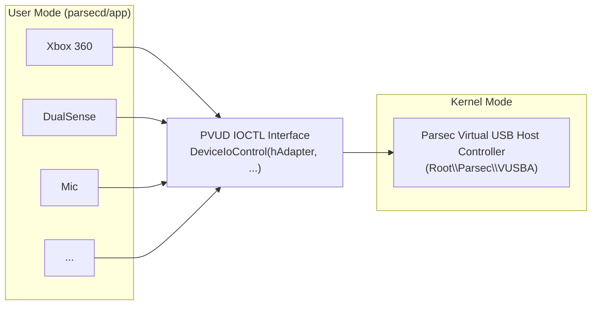

<p align="center">
  
</p>
<h1 align="center">Parsec VUSB</h1>
<p align="center">
  Reverse-engineered docs &amp; tools for Parsec Virtual USB Driver (PVUD)
</p>
<p align="center">
  
  
</p>

<br />

## ℹ About

Parsec VUSB (officially **PVUD** — Parsec Virtual USB Driver) is a kernel-mode driver that creates a virtual USB host controller on Windows. Through this virtual bus, the Parsec host can plug in emulated USB devices — gamepads, microphones, mice, tablets, and passthrough USB devices — making them appear as real hardware to the guest OS and applications.

This project documents the driver's IOCTL interface, device lifecycle, and USB descriptor formats, all reverse-engineered from `parsecd-150-101.dll` (Windows x64, Parsec SDK 6.0). The goal is to enable standalone use of the PVUD driver independent of the Parsec app, similar to what my [parsec-vdd](https://github.com/nomi-san/parsec-vdd) does for the Parsec Virtual Display Driver.

### Supported virtual devices

| Port | Type | Description |
|:----:|------|-------------|
| 1 | Xbox 360 Controller | Standard XInput gamepad |
| 2 | DualSense (PS5) | Sony PS5 controller with isochronous endpoints |
| 3 | Virtual Microphone | USB audio device (isochronous transfer) |
| 4 | Virtual Mouse | Dummy HID mouse — keeps cursor visible, does not generate input |
| 5 | Virtual Tablet | Wacom Intuos Pro (M) digitizer for pen/tablet passthrough |
| 7 | DualShock 4 (PS4) | Sony PS4 controller |
| 8 | Virtual Yubikey | USB passthrough for Yubikey security keys (via LibUSB) |
| — | Virtual Camera | **Not PVUD** — uses Windows 11 Media Foundation (`MFCreateVirtualCamera`) |

### Requirements

- Windows 10 or later
- Parsec VUSB driver installed (`Root\Parsec\VUSBA`)
- Driver version ≥ **5** (older versions lack microphone and advanced endpoint support)

> **ViGEm fallback:** When PVUD is unavailable or version < 5, Parsec falls back to [ViGEm Bus](https://github.com/nefarius/ViGEmBus) for gamepad emulation (Xbox 360 and DualShock 4 only).

---

## 🏗 Architecture

PVUD registers a device interface identified by the GUID `{25EFC209-91FE-4460-A4B7-6A9E31C0D0F1}`. The host process opens this interface via `SetupDiGetClassDevs` + `CreateFileW`, then communicates entirely through `DeviceIoControl()`.



---

## 🔄 Device Lifecycle

Every virtual USB device follows the same lifecycle:

```
1. Open Adapter
   PCVUD_open_adapter (IOCTL 0x2A6404 — version handshake)
       ↓
2. Create Device
   PCVUD_device_create_ioctl (IOCTL 0x2AE804 — send full USB descriptor)
       ↓
3. Configure Endpoints
   PCVUD_set_endpoints      (IOCTL 0x2AA808 — set endpoint addresses)
   PCVUD_set_endpoint_types  (IOCTL 0x2AA81C — optional, for isochronous)
       ↓
4. Plug Into Bus
   PCVUD_device_plug (IOCTL 0x2AAC04 — device appears to Windows)
       ↓
5. I/O Loop
   PCVUD_event_poll_loop  (IOCTL 0x2AA810 — blocking event loop)
   PCVUD_endpoint_write   (IOCTL 0x2AB008 — host → device)
   PCVUD_endpoint_read    (IOCTL 0x2AF004 — device → host)
       ↓
6. Unplug
   PCVUD_device_unplug (IOCTL 0x2AAC08 — cleanup + remove)
```

---

## 📋 IOCTL Reference

### Adapter Management

| IOCTL | Name | Dir | Buffer | Description |
|-------|------|-----|--------|-------------|
| `0x2A6404` | `open_adapter` | In/Out | 20 B (v2) or 12 B (v1) | Version handshake. Tries 20 B first, falls back to 12 B on `ERROR_INVALID_USER_BUFFER` (1784). |
| `0x2AE408` | `query_version` | In/Out | 16 B | Query driver version. |
| `0x2AE804` | `device_create` | In/Out | ~556+ B (variable) | Create device with full USB descriptor. Returns **600-byte** (`0x258`) device context. |
| `0x2AE80C` | `get_persisted_slots` | In/Out | 96 B | Get port mapping. Returns bitmask of occupied ports (up to 16 slots). |
| `0x2AE810` | `open_device_by_port` | In/Out | 9 B → variable | Get endpoint list for an existing device. First call returns count, second returns list. |

### Device Control

| IOCTL | Name | Dir | In Size | Description |
|-------|------|-----|---------|-------------|
| `0x2AAC04` | `device_plug` | In | 16 B | Plug device into virtual bus. |
| `0x2AAC08` | `device_unplug` | In | 8 B | Unplug device. Closes endpoint events and handles. |
| `0x2AA808` | `set_endpoints` | In | 9 + N B | Set endpoint addresses. Header: size(4) + port_id(4) + count(1), then N endpoint bytes. |
| `0x2AA81C` | `set_endpoint_types` | In | 9 + N B | Set transfer types (bulk, interrupt, isochronous). Same header format. |
| `0x2AA810` | `event_poll` | In/Out | 16 B | Blocking event poll. Loops on `GetOverlappedResult(TRUE)` until error 5 (`ACCESS_DENIED`) or 995 (`OPERATION_ABORTED`). |

### Endpoint Data Transfer

| IOCTL | Name | Dir | Layout | Description |
|-------|------|-----|--------|-------------|
| `0x2AB008` | `endpoint_write` | Out→Driver | 13 + data B | Write data to endpoint. |
| `0x2AF004` | `endpoint_read` | Driver→Host | 13 + data B | Read data from endpoint. Error 259 = pending (`ERROR_NO_MORE_ITEMS`). |
| `0x2AB010` | `write_status` | Out→Driver | 25 + data B | Write with transfer status. |
| `0x2AB024` | `write_alt` | Out→Driver | 25 + data B | Write data (alternate path). |
| `0x2AF00C` | `read_meta` | Driver→Host | 25 + data B | Read with metadata. |
| `0x2AF01C` | `read_timeout` | Driver→Host | 33 + data B | Read with timeout (9800 μs). |
| `0x2AF020` | `read_status` | Driver→Host | 17 + data B | Read with transfer status. |
| `0x2AA80C` | `control_xfer` | Out→Driver | 20–71 B | Control/descriptor transfer. |

### Isochronous Transfer (Audio)

| IOCTL | Name | Dir | Buffer | Description |
|-------|------|-----|--------|-------------|
| `0x2AF014` | `iso_setup` | In/Out | 149 B | Setup isochronous transfer. Returns number of packets (typically 10). |
| `0x2AB018` | `iso_write` | Out→Driver | 12×packets + 1001 B | Write audio data. 960 samples split across packets. Timeout: 10 ms. |

---

## 📦 Buffer Formats

### Endpoint I/O Header

All endpoint read/write IOCTLs (`0x2AB008`, `0x2AF004`) share this header:

```c
struct pvud_endpoint_io {
    uint32_t total_size;     // [0..3]   sizeof(header) + data_length
    uint32_t port_id;        // [4..7]   device port identifier
    uint8_t  endpoint_addr;  // [8]      USB endpoint address (e.g. 0x81 = IN EP1)
    uint32_t data_length;    // [9..12]  length of payload
    uint8_t  data[];         // [13..]   payload bytes
};
```

### Device Plug Buffer

```c
struct pvud_device_plug {
    uint32_t size;        // [0..3]   total struct size (16)
    uint32_t port_id;     // [4..7]   assigned port identifier
    uint8_t  port_a;      // [8]      sub-port A
    uint8_t  port_b;      // [9]      sub-port B
    uint16_t padding;     // [10..11]
    uint32_t port_num;    // [12..15] device port number (1–8)
};
```

### Device Context (Returned by `device_create`)

The `device_create` IOCTL (`0x2AE804`) returns a **600-byte** (`0x258`) structure:

```c
struct pvud_device_ctx {
    void*    device_handle;        // [0]     driver handle
    uint32_t reserved;             // [8]
    uint32_t port_id;              // [8]     assigned port ID
    uint32_t device_type;          // [12]    1=Xbox360, 2=DS5, 3=Mic, 4=Mouse, 5=Tablet, 7=DS4, 8=Yubikey
    void*    control_event;        // [16]    event for control requests
    void*    cancelled_event;      // [24]    event for cancellation
    void*    out_ep_events;        // [32]    array of OUT endpoint wait events
    void*    in_ep_events;         // [40]    array of IN endpoint wait events
    uint8_t  out_ep_addrs[256];    // [48]    OUT endpoint address list
    uint8_t  out_ep_count;         // [303]   number of OUT endpoints
    uint8_t  in_ep_addrs[256];     // [304]   IN endpoint address list
    uint8_t  in_ep_count;          // [559]   number of IN endpoints
    uint8_t  is_persistent;        // [560]   persistence flag
    //       ...
    void*    handler;              // [568]   event handler callback
    void*    owner_ctx;            // [576]   back-pointer to owner
    //       ...
    uint8_t  unplugged;            // [592]   set to 1 after unplug
};
```

---

## 🎮 Virtual Devices

### Xbox 360 Controller (Port 1)

The most common gamepad emulation. Creates a standard XInput-compatible device.

| Property | Value |
|----------|-------|
| bcdUSB | `0x0200` |
| bDeviceClass | `0xFF` (vendor-specific) |
| Port | 1 |
| Endpoints | 7-byte config: `[0x84B00001, 0x0201, 0x03]` |
| Handler | `sub_1801B9220` |
| Context size | 0x30 bytes (smallest) |

USB descriptor is built inline with a ~153-byte HID report descriptor. VID:`045E` PID:`028E`. Manufacturer: `L"©Microsoft Corporation"`, Product: `L"Controller"`.

### DualShock 4 (Port 7)

Sony PS4 controller emulation.

| Property | Value |
|----------|-------|
| USB descriptor | Inline (VID:`054C` PID:`05C4`, "Sony Corp." / "Wireless Controller") |
| Port | 7 |
| Endpoints | 2 endpoints, config value `0x04080484` |
| Handler | `sub_1801B76B0` |
| Context size | 0x38 bytes |

### DualSense (Port 2)

Sony PS5 controller. More complex than DS4 — uses isochronous endpoint types.

| Property | Value |
|----------|-------|
| USB descriptor | Inline (VID:`054C` PID:`0CE6`, "Sony Interactive Entertainment" / "Wireless Controller") |
| Port | 2 |
| Endpoints | 4 endpoints, config `0x03850081` |
| Endpoint types | `0x01010202` (4 bytes — includes isochronous) |
| Handler | `sub_1801B81F0` |
| Context size | 0x38 bytes |

DualSense additionally registers a USB class GUID via `sub_1801B97C0` and creates a separate I/O thread (`sub_1801B8760`). It is the only gamepad that uses `set_endpoint_types` (`0x2AA81C`).

### Virtual Microphone (Port 3)

USB audio device using isochronous transfers for real-time audio streaming.

| Property | Value |
|----------|-------|
| bcdUSB | `0x0110` |
| Device class | Vendor-specific audio (`0xF0510800`) |
| Port | 3 |
| Endpoint | `0x81` (IN EP1, isochronous) |
| Audio format | 960 samples/frame, 10 packets × 96 samples |

**Lifecycle:**
```
host_vmicrophone_manage (state machine: 0=destroy, 1=start, 2=persist)
    ↓
host_vmicrophone_init
    ├── audio_decode_init
    ├── PCVUD_microphone_open_by_port (if persistent slot exists)
    │   └── IOCTL 0x2AE810
    ├── PCVUD_microphone_device_create (if new)
    │   └── IOCTL 0x2AE804
    ├── Audio decode thread
    └── Isochronous transfer thread
        └── IOCTL 0x2AF014 (setup) + 0x2AB018 (write)
```

**Isochronous transfer detail:**
1. **Setup** (IOCTL `0x2AF014`): 149-byte buffer, endpoint `0x81`, requests 10 packets
2. **Write** (IOCTL `0x2AB018`): `12 × packets + 1001` bytes
   - 960 samples split into 10 packets of 96 samples each
   - Packet descriptor: `[offset:4][length:4][status:4]` (12 bytes per packet)
   - Audio data follows the descriptors
   - Timeout: 10 ms

**Version requirement:** VUSB driver type 2 with version ≥ 5, or type > 2.

### Virtual Mouse (Port 4)

Dummy HID mouse device created during owner connections. Its sole purpose is to keep the mouse cursor visible on the host even if no physical mouse is plugged in. **This mouse does not generate any input** — it's purely a presence device.

| Property | Value |
|----------|-------|
| bcdUSB | `0x0200` |
| Interface | `0xBEFC0000` (vendor-specific) |
| Port | 4 |
| Endpoints | 3: `[0x81, 0x83, 0x85]` (IN, interrupt/isochronous) |
| HID report | 84 bytes (21 DWORDs) |
| Handler | `sub_1801BBC30` |

Created when "Virtual Mouse" is enabled in host settings (on by default).

### Virtual Tablet (Port 5)

Emulates a **Wacom Intuos Pro (M)** digitizer for native pen/tablet passthrough. When connecting from a Windows client with a 2017+ Wacom Tablet, this replaces Windows Ink pen injection and simulates a native Wacom tablet experience with support for tilt, rotation, and pressure.

| Property | Value |
|----------|-------|
| bcdUSB | `0x0200` |
| Interface | `0x056A0800` (Wacom digitizer class) |
| Port | 5 |
| Endpoints | 3: `[0x81, 0x83, 0x85]` (IN, isochronous) |
| Report descriptor | 75-byte HID descriptor (Wacom pen digitizer) |
| Manufacturer/Product | `"W"` / `"W"` (Wacom) |
| Handler | `sub_1801BC060` |
| Key functions | `VirtualWacomIntuosProMDeviceFormatPenReport`, `VirtualWacomIntuosProMDeviceSubmitPenReport` |

Initialization allocates a 0x70-byte context and creates **4 threads**:
1. Input processing (`sub_1800B8860`)
2. Output processing (`sub_1800B8F90`)
3. State management (`sub_1800B90A0`)
4. VUSB I/O (`sub_1801BCB30`)

Uses two queues: 15 items × 0x7A4 bytes each (input and output) with mutex synchronization.

> **Warp feature:** Virtual Tablet is a Parsec Warp feature (requires subscription).

### Virtual Yubikey Passthrough (Port 8)

USB device passthrough for Yubikey security keys (generation 5). Unlike other virtual devices which have hardcoded USB descriptors, the Yubikey passthrough captures a **real physical Yubikey** on the client via [LibUSB](https://libusb.info/) and forwards the full USB descriptor + endpoint data over the network to a virtual USB device on the host.

| Property | Value |
|----------|-------|
| Port | 8 |
| Device type | 8 (passthrough) |
| USB descriptor | Captured from real device (variable) |
| Context size | 0x70 bytes |
| Create function | `PCVUD_passthroughusb_device_create` (via `PCVUD_device_create_wrapper`) |
| Control handler | `PCVUD_passthroughusb_handle_control_request` (`sub_1801BAE80`) |

**Client-side:** Uses LibUSB (`libusb-1.0.dll`) to access the physical Yubikey:
- Parsec can auto-install LibUSB, or the user can self-manage (`C:\Windows\System32\libusb-1.0.dll`)
- LibUSB functions loaded: `libusb_init`, `libusb_open`, `libusb_control_transfer`, `libusb_interrupt_transfer`, `libusb_bulk_transfer`, `libusb_claim_interface`, etc.

**Host-side lifecycle:**
```
Client captures Yubikey USB descriptor via LibUSB
    ↓
Message type 15: Host receives USB descriptor (product, manufacturer, extended desc)
    ↓
Message type 11: Host creates virtual USB device
    ├── PCVUD_device_create_wrapper (IOCTL 0x2AE804)
    ├── PCVUD_device_plug (port 8)
    ├── Control request handler thread
    ├── Event poll thread
    └── I/O transfer thread
    ↓
Message type 10: Endpoint data forwarded to/from device
    ↓
Message type 12/13: Device cleanup / unplug
```

### Virtual Camera (Not PVUD)

The Virtual Camera is **not** a PVUD device. It uses the Windows 11 **Media Foundation** API (`MFCreateVirtualCamera` from `mfsensorgroup.dll`) to create a virtual camera source. This requires Windows 11 — on Windows 10, the feature is unavailable.

The camera captures video on the client side and streams it to the host where it appears as a standard camera device via Media Foundation's virtual camera framework.

---

## 🔌 Host Integration

### Session Startup Order

When a Parsec host session begins (`host_session_start` — `0x1800A10B0`):

1. **VUSB adapter init** — version check, ViGEm fallback
2. VDD custom resolutions (3 slots)
3. VDD virtual displays + privacy thread
4. **Virtual mouse** (if privacy mode enabled)
5. Screen blanking via `PostMessageW(WM_SYSCOMMAND, SC_MONITORPOWER)`
6. Resolution clamping (max 8192×4320)
7. Host video capture thread

### VUSB Adapter Init

```c
// host_vusb_adapter_init (0x1800A7500)
if (!PCVUD_is_operable || version < 5) {
    // Fall back to ViGEm bus
    LOG("Using %s for host gamepad input", "ViGEm");
} else {
    // Allocate 0x58 context, create queue(5 items, 4 bytes each)
    // Start worker thread
    LOG("Using %s for host gamepad input", "PCVUD");
}
```

### Controller Plug Dispatch

When a client connects a gamepad (`host_controller_plug` — `0x180051070`):

| Type | Controller | VUSB Function | ViGEm Fallback | Port |
|:----:|-----------|---------------|----------------|:----:|
| 1 | Xbox 360 | `PCVUD_xbox360_device_create` | `vigem_target_x360_alloc` | 1 |
| 2 | DualShock 4 | `PCVUD_ds4_device_create` | `vigem_target_ds4_alloc` | 7 |
| 3 | DualSense | `PCVUD_ds5_device_create` | `vigem_target_ds4_alloc` | 2 |

> Note: DualSense falls back to DS4 on ViGEm since ViGEm has no native DS5 target.

### Adapter Recovery

A monitoring loop (`host_vdd_adapter_monitor` — `0x1800A71E0`) handles driver recovery:
- Polls every 100 ms (idle) or 1000 ms (active)
- Attempts `adapter_create` up to 3 times
- 5-fault-in-5-second limit before giving up
- Dynamic adapter re-creation on driver recovery

---

## 📍 Function Map

Addresses from `parsecd-150-101.dll`:

<details>
<summary>Core VUSB functions</summary>

| Address | Name | Description |
|---------|------|-------------|
| `0x1801B6AE0` | `PCVUD_open_adapter` | Open adapter, version handshake |
| `0x1801AFBF0` | `PCVUD_check_driver_version` | Registry + GetFileVersionInfo |
| `0x1801B4A50` | `PCVUD_device_create_ioctl` | Core device creation (IOCTL 0x2AE804) |
| `0x1801BAAD0` | `PCVUD_device_create_wrapper` | Wrapper: maps types, calls create_ioctl |
| `0x1801B5770` | `PCVUD_device_plug` | IOCTL 0x2AAC04 — plug into bus |
| `0x1801B58D0` | `PCVUD_device_unplug` | IOCTL 0x2AAC08 — unplug + cleanup |
| `0x1801B64A0` | `PCVUD_set_endpoints` | IOCTL 0x2AA808 — configure endpoints |
| `0x1801B6300` | `PCVUD_set_endpoint_types` | IOCTL 0x2AA81C — set transfer types |
| `0x1801B5E20` | `PCVUD_endpoint_write` | IOCTL 0x2AB008 — write to endpoint |
| `0x1801B5C80` | `PCVUD_endpoint_read` | IOCTL 0x2AF004 — read from endpoint |
| `0x18015EF00` | `PCVUD_event_poll_loop` | IOCTL 0x2AA810 — blocking event loop |
| `0x1801BB620` | `PCVUD_isochronous_transfer` | IOCTLs 0x2AF014 + 0x2AB018 |
| `0x1801B5520` | `PCVUD_get_persisted_slots` | IOCTL 0x2AE80C — port mapping |
| `0x1801B5090` | `PCVUD_open_device_by_port` | IOCTL 0x2AE810 — open existing |

</details>

<details>
<summary>Device-specific creators</summary>

| Address | Name | Description |
|---------|------|-------------|
| `0x1801B89D0` | `PCVUD_xbox360_device_create` | Xbox 360 controller |
| `0x1801B7050` | `PCVUD_ds4_device_create` | DualShock 4 |
| `0x1801B7B30` | `PCVUD_ds5_device_create` | DualSense |
| `0x1801BB1A0` | `PCVUD_microphone_device_create` | Virtual microphone |
| `0x1801BB3D0` | `PCVUD_microphone_open_by_port` | Reopen persistent mic |
| `0x1801BBA40` | `PCVUD_vmouse_device_create` | Virtual mouse |
| `0x1801BCDC0` | `PCVUD_vtablet_device_create` | Virtual tablet |
| `0x1801B71D0` | `PCVUD_vmouse_device_destroy` | Destroy virtual mouse |
| `0x1800B9B90` | `PCVUD_passthroughusb_handler` | Yubikey passthrough message handler |
| `0x1801BAE80` | `PCVUD_passthroughusb_control` | Yubikey control request handler |

</details>

<details>
<summary>Host integration</summary>

| Address | Name | Description |
|---------|------|-------------|
| `0x180051070` | `host_controller_plug` | Gamepad plug dispatcher |
| `0x1800A7500` | `host_vusb_adapter_init` | VUSB adapter init + ViGEm fallback |
| `0x1800A10B0` | `host_session_start` | Session startup orchestrator |
| `0x1800B83D0` | `host_vmicrophone_init` | Virtual microphone init |
| `0x1800B8260` | `host_vmicrophone_destroy` | Virtual microphone cleanup |
| `0x1800A1DD0` | `host_vmicrophone_manage` | Microphone state machine |
| `0x1800B9490` | `host_vtablet_init` | Virtual tablet init |
| `0x1800B9EC0` | `host_vyubikey_loop` | Yubikey passthrough control loop |
| `0x18003FDF0` | `mf_virtual_camera_init` | Virtual camera Media Foundation init (not PVUD) |

</details>

---

## ⚡ Quick Start (Pseudocode)

```c
// 1. Open the VUSB adapter
HANDLE adapter = open_device(PVUD_DEVICE_GUID);
pvud_open_adapter(adapter);  // IOCTL 0x2A6404

// 2. Create a virtual Xbox 360 controller
uint8_t usb_desc[556] = { /* Xbox 360 USB descriptor */ };
pvud_device_ctx ctx;
DeviceIoControl(adapter, 0x2AE804, usb_desc, sizeof(usb_desc),
                &ctx, sizeof(ctx), ...);

// 3. Configure endpoints
uint8_t ep_header[9] = { /* size, port_id, count */ };
uint8_t ep_addrs[] = { 0x81, 0x02 };  // IN EP1, OUT EP2
DeviceIoControl(adapter, 0x2AA808, ep_data, sizeof(ep_data), ...);

// 4. Plug the device
pvud_device_plug plug = {
    .size = 16, .port_id = ctx.port_id,
    .port_a = 0, .port_b = 0, .port_num = 1
};
DeviceIoControl(adapter, 0x2AAC04, &plug, 16, ...);

// 5. Write gamepad state (in a loop)
pvud_endpoint_io pkt = {
    .total_size = 13 + report_size,
    .port_id = ctx.port_id,
    .endpoint_addr = 0x02,
    .data_length = report_size,
};
memcpy(pkt.data, gamepad_report, report_size);
DeviceIoControl(adapter, 0x2AB008, &pkt, 13 + report_size, ...);

// 6. Unplug when done
DeviceIoControl(adapter, 0x2AAC08, &port_id, 8, ...);
CloseHandle(adapter);
```

---

## 😥 Known Limitations

- **No Linux/macOS support** — PVUD is a Windows kernel driver, Windows 10+ only
- **Driver not publicly distributed** — must be extracted from a Parsec installation
- **Microphone requires driver v5+** — older versions silently fail
- **DualSense on ViGEm** — falls back to DS4 emulation (no haptics, adaptive triggers)
- **Maximum port range** — port numbers 1–8 are hardcoded per device type
- **USB descriptors are embedded** — changing VID/PID requires patching the binary (except Yubikey which captures real descriptors)
- **Yubikey requires LibUSB** — must be installed on the client machine
- **Virtual Camera requires Windows 11** — not available on Windows 10 (not a PVUD device)

---

## 🍻 Credits

- Reverse-engineered from `parsecd-150-101.dll` using IDA Pro
- Thanks to Parsec for building the driver
- Inspired by my [parsec-vdd](https://github.com/nomi-san/parsec-vdd)
